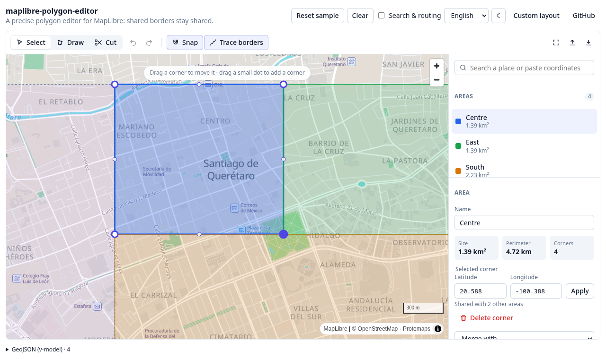

# maplibre-polygon-editor

A **precise, topology-aware polygon editor** for [MapLibre GL JS](https://maplibre.org), with a
Vue 3 component on top. Draw delivery zones, sales territories, school districts — any set of
areas that tile the ground — and keep their shared borders _shared_.

**▶ [Try it live](https://rsansores.github.io/maplibre-polygon-editor/)** — it runs entirely in your
browser. The basemap is a single vector-tile file served next to the page: no tile server, no API
key.



## Why another polygon editor

Most map drawing tools treat every polygon on its own. Draw two areas side by side and you get
two borders that _almost_ touch: a sliver of gap here, a sliver of overlap there, and an address on
the line that belongs to both or neither. This editor is built around the opposite rule:

- **A shared border is one border.** Two areas that touch hold the _same_ vertices along it. Drag a
  shared corner and every area holding it follows; insert a corner on a shared edge and it appears
  in both. A new area drawn over a neighbour is trimmed to the free ground and takes the
  neighbour's border vertex for vertex.
- **Every click lands exactly where it was made.** No smoothing, no simplification, no vertex cap.
  Coordinates are rounded to a fixed precision (8 decimals ≈ 1 mm by default), which is what lets
  two areas hold the very same vertex.
- **The map data is a helper, never a gate.** Corners snap to existing borders and to streets, and
  a segment between two clicks on the same border or street can follow it. But a border through a
  forest, across a field or through an unmapped neighbourhood is drawn just as easily: hold
  <kbd>Alt</kbd>, turn snapping off, type coordinates, or paste them. Nothing in the editor
  depends on the basemap being right.
- **Nothing is lost silently.** An edit that would break a rule (a border crossing itself, two
  areas overlapping) is refused _and explained_; an unfinished drawing stays on screen to be fixed.

## Features

|                     |                                                                                                                                                                             |
| ------------------- | --------------------------------------------------------------------------------------------------------------------------------------------------------------------------- |
| **Draw**            | Click corners; click the first one, double-click or press <kbd>Enter</kbd> to close. <kbd>Backspace</kbd> removes the last corner.                                          |
| **Snap**            | To corners, to borders (exactly onto the edge), to streets of the basemap. Hold <kbd>Alt</kbd> for a free point.                                                            |
| **Trace**           | Two clicks on the same border or street follow it, so a new area hugs its neighbour without clicking every vertex.                                                          |
| **Follow roads**    | Optional: plug in a router (OSRM adapter included) and a segment between two streets follows the road network. Falls back to a straight line when the route is implausible. |
| **Edit**            | Drag corners (shared ones move together), drag a midpoint to add a corner, delete a corner, type exact coordinates.                                                         |
| **Cut**             | Draw a line across an area to split it in two; both halves share the cut.                                                                                                   |
| **Merge**           | Join two areas that share a border.                                                                                                                                         |
| **Validate**        | Same rules as PostGIS `ST_IsValid`, plus no overlaps (configurable: trim, forbid or allow).                                                                                 |
| **Locked areas**    | Shown, snapped to and checked against, but not editable — someone else's neighbouring areas.                                                                                |
| **Search**          | Paste coordinates in any common format (decimal, degrees-minutes-seconds, `geo:` URIs), or plug in a geocoder (Photon adapter included).                                    |
| **Import / export** | GeoJSON (RFC 7946 winding) and KML (Google My Maps, Google Earth).                                                                                                          |
| **Undo / redo**     | Every edit, as one step; a drag is one step.                                                                                                                                |
| **Measure**         | Area, perimeter, and the length of the segment being drawn.                                                                                                                 |
| **Theming**         | Inherits a shadcn-style design-token contract (`--color-primary`, …). Light and dark.                                                                                       |
| **i18n**            | English and Spanish built in; follows the host's `vue-i18n` locale with no wiring.                                                                                          |

## Install

```bash
npm i maplibre-polygon-editor maplibre-gl vue
```

```vue
<script setup lang="ts">
import { ref } from 'vue'
import { PolygonEditor, type Area } from 'maplibre-polygon-editor'
import 'maplibre-polygon-editor/styles.css'

const areas = ref<Area[]>([])
</script>

<template>
  <div style="height: 600px">
    <PolygonEditor v-model="areas" map-style="https://demotiles.maplibre.org/style.json" />
  </div>
</template>
```

`areas` is plain JSON — an array of `{ id, rings, properties }`. Persist it however you like, or
turn it into GeoJSON with `toFeatureCollection(areas)`.

> **Using Vite with MapLibre 6?** MapLibre loads its worker from a separate file; tell it where
> the bundler put it, once, at startup:
>
> ```ts
> import { setWorkerUrl } from 'maplibre-gl'
> import workerUrl from 'maplibre-gl/dist/maplibre-gl-worker.mjs?url'
> setWorkerUrl(workerUrl)
> ```

## Documentation

- **[Integration guide](docs/integration.md)** — props, your own layout, your own map, theming,
  i18n, snapping to your basemap's streets, search and routing services, self-hosting tiles,
  storing and validating areas on a server (PostGIS), and using the core without Vue.
- **[How it works](docs/architecture.md)** — the data model, how shared borders stay shared, the
  precision model, and how validation matches PostGIS.
- **[Contributing](CONTRIBUTING.md)** and **[Releasing](RELEASING.md)**.

## Packages and entry points

| Import                               | What it is                                                                                                                                        |
| ------------------------------------ | ------------------------------------------------------------------------------------------------------------------------------------------------- |
| `maplibre-polygon-editor`            | The Vue 3 component (`PolygonEditor`), the headless composable (`usePolygonEditor`), the connected parts, and everything in `/core`.              |
| `maplibre-polygon-editor/core`       | Framework-agnostic: the editor state machine (`PolygonEditorCore`), the MapLibre binding (`MapBinding`), geometry, GeoJSON/KML, adapters. No Vue. |
| `maplibre-polygon-editor/styles.css` | The stylesheet for the Vue parts.                                                                                                                 |

Peer dependencies: `maplibre-gl` 5 or 6, and `vue` 3.4+ (only for the Vue entry point).

## Develop

```bash
pnpm install
pnpm dev                 # the demo, with hot reload, on http://localhost:5198
pnpm test                # unit tests (geometry, topology, editor flows)
pnpm test:e2e            # browser tests against the demo (Playwright + real MapLibre)
pnpm lint && pnpm type-check && pnpm format:check && pnpm knip
pnpm build               # the library, into dist/
pnpm build:demo          # the demo, into dist-demo/ (what GitHub Pages serves)
```

The demo's basemap (`demo/public/data`) is a 5.5 MB extract of one city — Querétaro, Mexico,
with its rural edge — built by `scripts/fetch-demo-data.sh` from the
[Protomaps](https://protomaps.com) daily OpenStreetMap build.

## License

Licensed under either of [Apache License, Version 2.0](LICENSE-APACHE) or [MIT license](LICENSE-MIT)
at your option. Map data in the demo © [OpenStreetMap](https://www.openstreetmap.org/copyright)
contributors.
